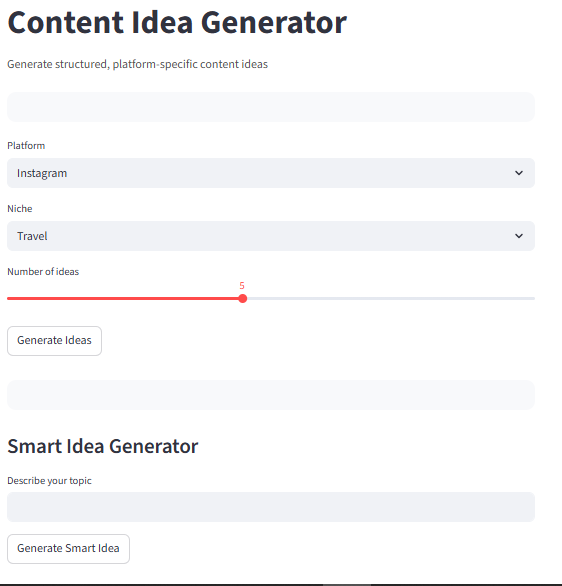

# Content Idea Generator

A professional, UI-focused Content Idea Generator built using Python and Streamlit.  
This tool helps creators generate structured, platform-specific content ideas with a clean interface, dark/light mode support, and zero API dependency.

---

## Features

- Platform-specific idea generation (Instagram, YouTube, LinkedIn)
- Multiple ideas generation (1–10 at a time)
- One-click copy to clipboard
- Smart rule-based AI-style idea generator (no external API)
- Dark mode / Light mode toggle
- Clean, professional, resume-ready UI
- Developer profile and contact links included

---

## Tech Stack

- Python
- Streamlit
- Custom CSS
- Pyperclip

---

## Screenshots


### Idea Generation


---

## Installation

Clone the repository:

```bash
git clone https://github.com/hiranmoy-pati/content-idea-generator.git
cd content-idea-generator